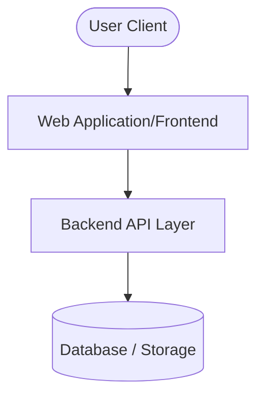

# System Architecture

> [!NOTE]
> **Purpose:** Reference diagrams and maps detailing system layout, component relationships, and data flows.

---

## 🗺️ High-Level System Overview

Provide a high-level summary of how these layers interact, the deployment boundaries, and the network topologies.

---

## 📦 Core Domain Boundaries

Identify the core domains, services, or modules that make up the system:
- **[Boundary 1]:** [Role and responsibility of this boundary]
- **[Boundary 2]:** [Role and responsibility of this boundary]

---

## 🔄 Data Flow & State Transitions

Describe how data moves through the system during a key transaction or action:
1. **[Step 1]:** User triggers an event.
2. **[Step 2]:** State transitions or API triggers occur.
3. **[Step 3]:** Persistent changes are saved to the database.

---

## ❓ Open Questions

- *What architectural uncertainties or system boundaries are still fuzzy?*
- [ ] Question 1: [Short description of architectural question]

---

## 🚀 Next Steps

- *Upcoming scaling, decoupling, or architectural enhancements.*
- [ ] Task 1: [Short description of architectural improvement]
