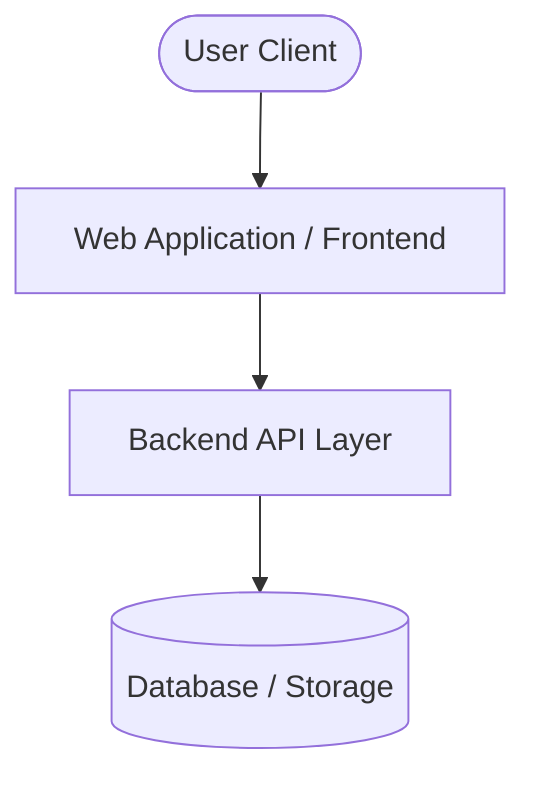

# System Architecture: {{PROJECT_NAME}}

> [!NOTE]
> **Purpose:** Reference diagrams and maps detailing system layout, component relationships, and data flows.

---

## 🗺️ High-Level System Overview

```mermaid
graph TD
    User([User Client]) --> WebApp[Web Application / Frontend]
    WebApp --> API[Backend API Layer]
    API --> DB[(Database / Storage)]
```

Provide a high-level summary of how these layers interact, deployment boundaries, and network topologies for {{PROJECT_NAME}}.

---

## 📦 Core Domain Boundaries

Identify the core domains, services, or modules that make up {{PROJECT_NAME}}:
- **{{DOMAIN_BOUNDARY_1}}:** {{DOMAIN_BOUNDARY_1_DESCRIPTION}}
- **{{DOMAIN_BOUNDARY_2}}:** {{DOMAIN_BOUNDARY_2_DESCRIPTION}}

---

## 🔄 Data Flow & State Transitions

Describe how data moves through the system during a key transaction or action:
1. **Step 1:** User triggers an event.
2. **Step 2:** State transitions or API triggers occur.
3. **Step 3:** Persistent changes are saved to storage.

---

## ❓ Open Questions

- [ ] Question 1: {{ARCHITECTURAL_QUESTION_1}}

---

## 🚀 Next Steps

- [ ] Task 1: {{ARCHITECTURAL_TASK_1}}
